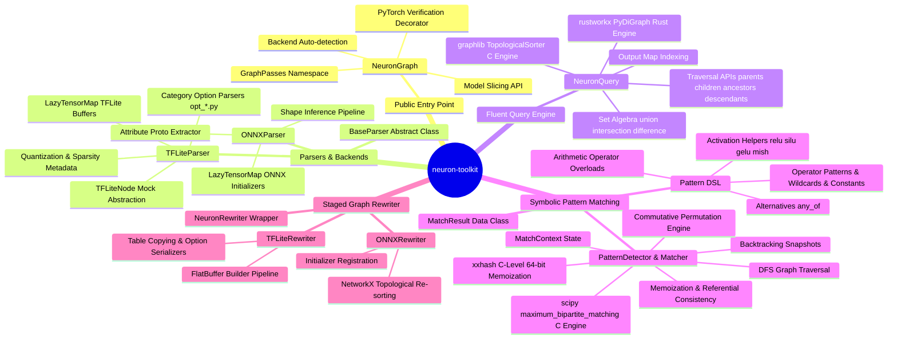
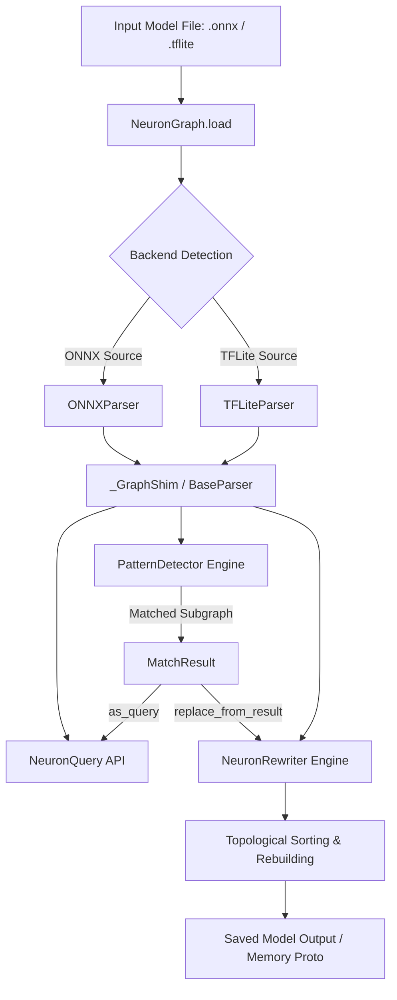
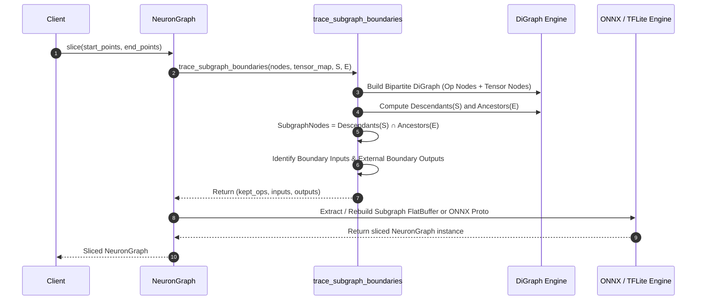
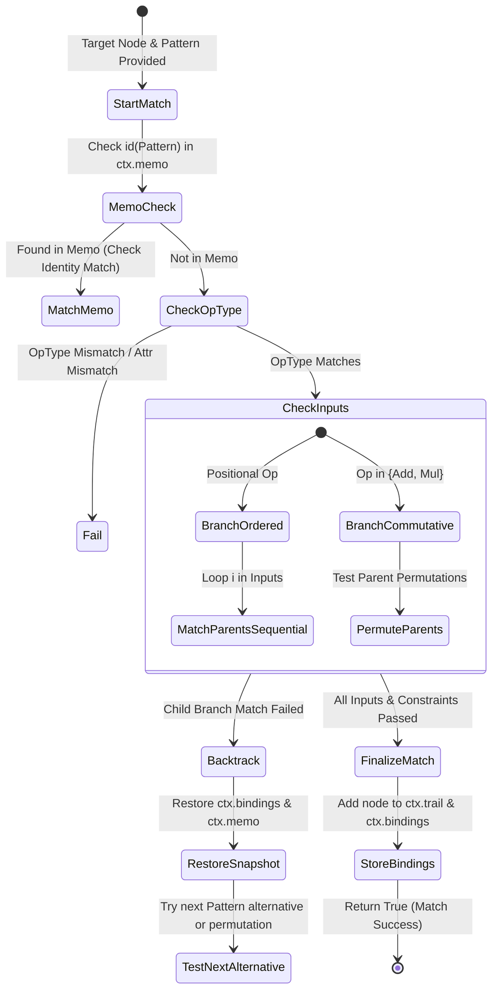

# Architecture Overview & Mermaid Mindmaps

This document provides high-level system mindmaps, component hierarchy diagrams, and data flow models for the `neuron-toolkit` codebase. It is designed to allow AI Agents and senior engineers to rapidly understand the structural relationships across all subsystems.

---

## 1. System Architecture Hierarchy Mindmap

---

## 2. Model Pipeline & Execution Flow Diagram

---

## 3. Subgraph Boundary Slicing Flow

---

## 4. Pattern Search State Machine (DFS & Backtracking)

